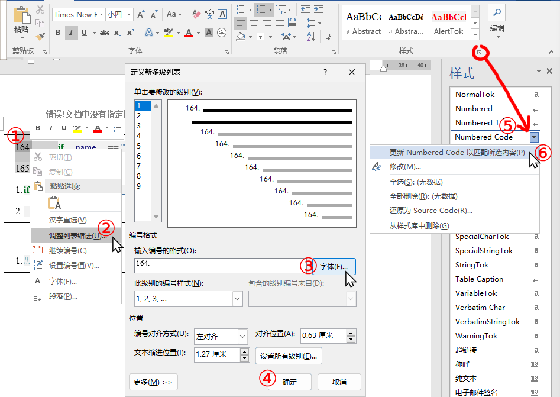
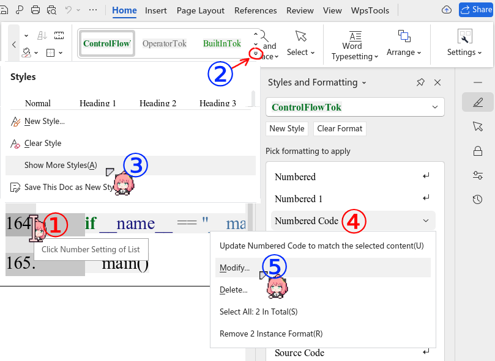
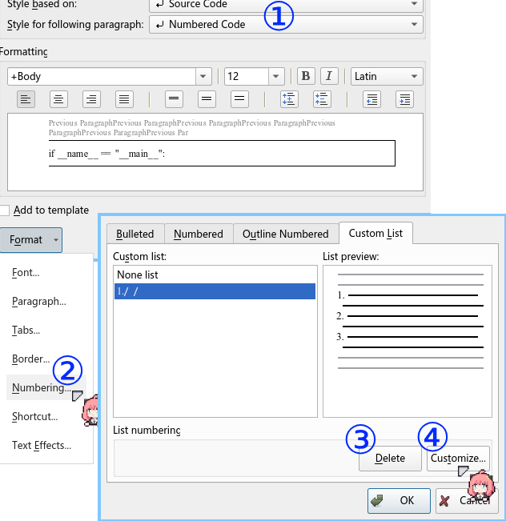

# pandoc code include

## Install
```sh
pip install git+https://github.com/AClon314/pandoc-code-include.git
```
> [!NOTE]
> use the **same python/pip environment** when you call `pandoc`.

Enable with `--filter` or `--defaults=config.yaml`:
```sh
pandoc --filter pandoc-code-include -o out.pdf input.md
```

Use `DEBUG=1` as env to print extra messages:
```sh
DEBUG=1 pandoc --filter pandoc-code-include ...
```

## Usage
### include whole file
~~~markdown
```{.c include=main.c}
~~~

### snippet
Support all languages, start and end with `... snippet <tag>`.

```c
// snippet tag1
printf("c");
// snippet tag1
```
```python
# snippet tag2
print("python")
# snippet tag2
```

In markdown:
~~~markdown
```{.c include=main.c snippet=tag1}
```

```{.py include=main.py snippet=tag2}
```
~~~

> [!WARNING]
> I use **regex**, so there could be some edge cases. Please report if you find any.

### numberLines
~~~markdown
```{.py .numberLines}
~~~
---
If you like start from 1:
~~~markdown
```{.py .numberLines start=1}
~~~

#### adjust docx numbered style

### MS Word
1. Adjust style: `Numbered`
2. Or Like this:


### WPS

1. **Click** on the ordered number
2. Modify the `Numbered Code` style. *Suggest <code>Style <u>b</u>ased on</code>: `Source Code`*
3. Open `Numbering...` dialog.
4. **Delete all** existing `Custom List` styles.
5. Reopen `Numbering...` dialog.
6. `Customize` as you want!




